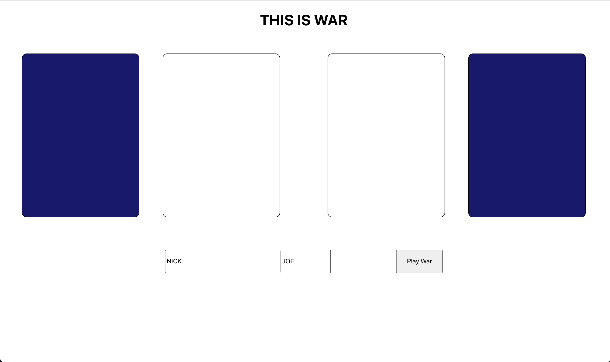
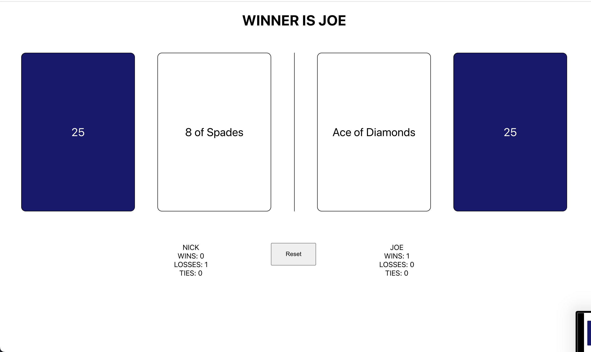

# Aspen Capital War Machine

Let's get this app up and running.

1. for this app you will need Docker which can be installed [here](https://docs.docker.com/engine/install/)
2. now open a terminal in the root of this cloned repo and run the following:
```
docker compose up
```
* this will take longer the first time
* you should see the following when the server is running
```
server       |  * Running on http://127.0.0.1:5001
server       |  * Running on http://172.25.0.3:5001 (Press CTRL+C to quit)
server       |  * Restarting with stat
server       |  * Debugger is active!
server       |  * Debugger PIN: 597-907-156
```
3. now open a new terminal
4. change the directory to react-app
```
cd react-app/
```
5. run the following command to start your react-app
```
npm start
```
6. if create-react-app doesn't automatically open a browser tab for you, try opening one and typing the following in the url field at the top
```
http://localhost:3000
```
7. this app is very simple and allows you to type player names and select "Play War"



8. the game then plays out before your eyes until one or both players run out of cards
9. you can skip this animation
10. once the game is over you can check the player records
11. records are saved in the database by player name



## My Thoughts
- This was a fun project. I don't work on game applications too often. I think working out the game logic is a lot of fun.
- If I had more time I would have loved to spend it creating tests for my server and react app.
- In this state the app also lacks in terms of error handling. For example the app does not handle two of the same player name strings submitted for one game.
- Lastly, I would love to add some animations and proper CSS styling. This app is incredibly basic and it was hard for me to resist putting more time into the look.

## My Strategy
- while brainstorming for this web game, my mind immedietely jumped to vulnerabilites with cheating
- I decided to let the entire game play out on the server since player choice is not a factor in this game
- the server then returns a play-by-play "script" which the react-app reads and "animates" for the players
- even if the page is refreshed or the game is interrupted, the results and records of the game are already stored in the database
